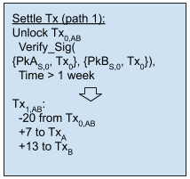
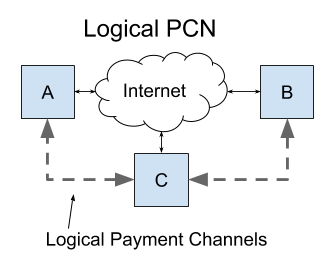
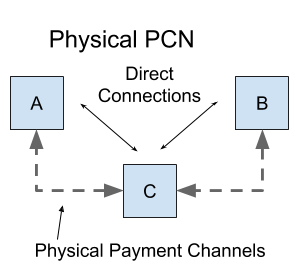

# 3. Concepts

### 3.1 Aggregate Signatures

The Bitcoin network uses the Elliptic Curve Digital Signature Algorithm \(ECDSA\) to sign transactions that transfer bitcoin from one address to another. Transactions are verified by checking associated ECDSA signatures. Even if other details of a transaction can be inferred or reconstructed, signatures must be supplied by the entity that authorizes a transaction. Because we want to optimize our protocol for low-bandwidth communication channels, we focus on how to reduce the size of the signatures that authorize transactions.

In particular, we would like a way to reduce the size of signatures for transactions with multiple signers. Multisignatures \[[18](references.md#18-maxwell-g-poelstra-a-seurin-y-wuille-p-2018-simple-schnorr-multi-signatures-with-applications-to-bitcoin-iacr-cryptology-eprint-archive-2018-68-2018)\] offer a solution for combining the signatures from two or more signers on a single message into a single signature. This technique can dramatically reduces the amount of data needed to communicate a multi-signature transaction.

Unfortunately, no efficient scheme exists to aggregate ECDSA signatures so proposals for signature aggregation of Bitcoin transactions require a new signature algorithm. Schnorr signatures support has been proposed for Bitcoin \[[17](references.md#17-wuille-p-bip-schnorr-mediawiki-url-https-github-com-sipa-bips-blob-bip-schnorr-bip-schnorr-mediawiki-accessed-29-sep-2018)\] and would, among other things, provide support for the MuSig \[[18](references.md#18-maxwell-g-poelstra-a-seurin-y-wuille-p-2018-simple-schnorr-multi-signatures-with-applications-to-bitcoin-iacr-cryptology-eprint-archive-2018-68-2018)\] multisignature schemes. One problem with using MuSig to reduce communication overhead is that it requires multiple rounds of interaction between signers. A suggestion for non-interactive half-aggregation \[[19](references.md#19-dryja-t-bitcoin-dev-per-block-non-interactive-schnorr-signature-aggregation-url-https-lists-linuxfoundation-org-pipermail-bitcoin-dev-2017-may-014272-html-accessed-29-sep-2018)\] of Schnorr signatures has also been made, but would create signatures that grow in size with each signature added.

The BLS \[[20](references.md#20-boneh-d-lynn-b-shacham-h-2001-short-signatures-from-the-weil-pairing-in-boyd-c-eds-advances-in-cryptology-asiacrypt-2001-asiacrypt-2001-lecture-notes-in-computer-science-vol-2248-springer-berlin-heidelberg)\]\[[21](references.md#21-chia-bls-signatures-implementation-url-https-github-com-chia-network-bls-signatures-accessed-29-sep-2018)\] signature scheme has also been suggested as a solution for creating multi-signatures for Bitcoin transactions \[[22](references.md#22-boneh-d-drijvers-m-neven-g-2018-compact-multi-signatures-for-smaller-blockchains-iacr-cryptology-eprint-archive-2018-483-2018)\]. BLS signatures can also be used for general signature aggregation \[[23](references.md#23-boneh-d-gentry-c-lynn-b-shacham-h-2003-aggregate-and-verifiably-encrypted-signatures-from-bilinear-maps-in-biham-e-eds-advances-in-cryptology-eurocrypt-2003-eurocrypt-2003-lecture-notes-in-computer-science-vol-2656-springer-berlin-heidelberg)\]. Unfortunately, Bitcoin is unlikely to adopt BLS signatures due to their more complicated security assumptions and higher computational requirements for verification. Although BLS signatures require more computation to verify signatures, computation is relatively less power- and time-consuming than transmitting data for mobile devices \[[24](references.md#24-szczechowiak-p-oliveira-l-scott-m-collier-m-dahab-r-2008-nanoecc-testing-the-limits-of-elliptic-curve-cryptography-in-sensor-networks-in-verdone-r-eds-wireless-sensor-networks-ewsn-2008-lecture-notes-in-computer-science-vol-4913-springer-berlin-heidelberg)\]. For low-bandwidth mobile mesh networks the increased verification time of pairing based signature schemes like BLS is justified by the reduction in data transmission achieved using signature aggregation.

We discuss the trade-offs of using Schnorr multisignatures and BLS signature aggregation in [Appendix D](../appendix/d_bls-versus-schnorr.md). Our conclusion is that Schnorr multisignatures have the best technical tradeoffs for this protocol.

### 3.2 Payment Channels

Payment channels \[[10](references.md#10-bitcoin-wiki-contracts-example-7-rapidly-adjusted-micro-payments-to-a-pre-determined-party-url-https-en-bitcoin-it-wiki-contracts-example_-7-_rapidly-adjusted_-28-micro-29-payments_to_a_pre-determined_party-accessed-29-sep-2018)\]\[[11](references.md#11-bitcoinj-working-with-micropayment-channels-url-https-bitcoinj-github-io-working-with-micropayments-accessed-29-sep-2018)\] are used to make local bidirectional payments between nodes. They reduce the transactions that must be settled on the distributed ledger to only setup and settlement transactions. Update transactions exchanged directly between nodes to modify the current split of value in a shared multisignature address do not need to be immediately communicated to an internet connected Bitcoin node.

Validating many small transfers between nodes using the Bitcoin blockchain directly would require internet access for each payment. With payment channels, value is locked in a shared transaction output which both nodes must authorize any spending from. Nodes directly negotiate how tokens stored in the shared transaction’s outputs should be divided. Nodes only need to communicate the final balance split with a final settlement transaction sent to the blockchain once they are done exchanging payments.

![Figure 4: At time t1 Node B proposes a payment channel by signing a Refund transaction back to Node A. At time t2 Node A opens the channel by signing a Setup transaction to fund the channel and both paths of an UpdateAndSettle transaction to offer a new state update to Node B. To be valid the transaction requires Node B&#x2019;s signature and a secret that proves message m was delivered. Node B can update the transaction state at time t3 by adding their own signature and the secret for message m that proves it was delivered. At time t4 Node A can sign a final Close transaction to make the transfer to Node B final without a delay if Node B presents the secret that proves delivery for a new message m.](../.gitbook/assets/fig4.png)

Payment channel transactions use scripts that encode the rules for how to update and settle the value split between nodes. These rules include a timeout so that if one node stops responding, the other can finalize the most recently settled split. This timeout is tuned to prevent a malicious node from trying to finalize an out of date balance update. In our usage, settlement transactions also require proof that a message has been delivered. This makes channel updates valid only when an associated message delivery is successful.

![Figure 5: Pseudo code for UpdateAndSettle output script that must be satisfied to spend from a payment channel transaction \(eg. Tx0,AB\). The first path transfers tokens from the jointly controlled transaction 1 week after the last channel update was committed. The second path immediately transfers all of the value to a new Tx1,AB controlled by both Nodes A and B if the new transaction state is greater than the old state and if Node D has revealed the preimage associated with message m1. If the update transaction is signed and settled before the 1 week delay, then the update to the next state of the channel \(with a different value split\) makes the old settlement transaction invalid.](../.gitbook/assets/fig5.png)

Our payment channels are based on Decker-Russell-Osuntokun eltoo channels \[[25](references.md#25-decker-c-russell-r-osuntokun-o-2018-eltoo-a-simple-layer2-protocol-for-bitcoin-https-blockstream-com-eltoo-pdf-accessed-29-sep-2018)\] and assume a conditional input script that either cooperatively transfers the tokens to an address with a newer state or settles the channel unilaterally after some delay \(Figure 5\).

For example, Node A commits to pay Node B to relay data m1 to message destination node D by signing a settlement transaction that unlocks the balance controlled by Tx0,AB with output script _UpdateAndSettle_ \(Figure 6\). If Node B also signs the script and reveals the secret from Node D for the data m1 then Node B can settle the payment channel one week after the transaction that funded Tx0,AB is settled. Tokens controlled by the transaction Tx0,AB will be distributed based on the allocation \(eg. 7 to Node A and 13 to Node B\) Node A committed to pay to Node B if data m1 was delivered.

Even if Node A becomes unresponsive, as long as Node B has proof that Node A also signed the transaction and Node D’s signature for m1 proving it was delivered, then Node B can settle the payment channel after one week. However, if Node B wishes to commit to a new split of tokens with Node A, Node B can simply prove to Node A they have Node D’s signature for m1. Both nodes can then safely negotiate a new split that assumes the previous agreed settlement split was confirmed. Node A can now sign a new transaction with the same _UpdateAndSettle_ output script but with a newer state. Node A would sign a commit to the new split that pays Node B more tokens than the previous split conditioned on proof that some new data was delivered to a destination node.

In this way, nodes can make arbitrarily many bi-directional transfers between themselves without needing internet access to connect to the distributed ledger. If either node becomes unresponsive, then both will have enough information to settle the last payment they received after some delay. If at any point both nodes wish to settle the current state of their balances, they can cooperatively sign a closing transaction that does not have a 1 week delay encumbrance. The closing transaction can also be negotiated with an aggregate signature to reduce the amount of data that needs to be settled online.

### 3.3 Payment Channel Network

Our design builds off the concept of a payment channel network \(PCN\) pioneered by the Bitcoin Lightning Network \[[12](references.md#12-poon-j-dryja-t-2015-the-bitcoin-lightning-network-url-https-lightning-network-lightning-network-paper-pdf-accessed-29-sep-2018)\]. In this type of network, pairs of nodes connected by payment channels are organized into a connected graph that can safely route payments between nodes that do not have a direct payment channel established.

We propose a system that routes both data and payments over the same point-to-point communication channels. Current PCNs form an overlay network that routes payments over logical connections between nodes, but communicate using a different set of internet connected data routers.

Our physical PCN creates payment channels directly between nodes within radio range based on their physical location. Both data and payments are routed over the same network topology.

Existing online PCNs assume internet connectivity and direct access to the distributed ledger to confirm channel funding transactions when a new channel is set up.

In our physical PCN, transactions to set up and settle payment channels on the distributed ledger must be relayed through the mesh to an internet gateway.

### 3.4 Implied Transaction

Nodes transmit incentive headers to commit to payment channel transactions that transfer value from one node to another. The commitment to a transaction can be verified by checking the signatures created for these transactions. These transactions are not explicitly included in each incentive header. Instead nodes only transmit the information for each transaction that cannot be otherwise inferred from other information in the transmission.

For example, an incentive header might include a payment channel Update Tx transaction sent from Node A to Node B but does not need to include the payment addresses for Nodes A and B. These addresses can be deterministically computed by looking up a cached extended public key \(xpub\) \[[26](references.md#26-maxwell-g-2011-deterministic-wallets-url-https-bitcointalk-org-index-php-topic-19137-0-accessed-29-sep-2018)\]\[[27](references.md#27-wuille-p-bip-32-hierarchical-deterministic-wallets-url-https-github-com-bitcoin-bips-blob-master-bip-0032-mediawiki-accessed-29-sep-2018)\] for the nodes involved. For example, addresses can be deterministically generated by multiplying cached xpubs for Nodes A and B by a known nonce, such as the hash of the message. Xpubs can be exchanged and cached when new node IDs are first encountered or synced when a node is online.

Nodes must also aggregate their signatures for an implied transaction to be valid. Any node that reconstructs an implied transaction can use the aggregate signature to confirm the correct implied payment addresses were included in the implied transaction.

An important implied value in our protocol is a secret value computed from the payload data. This value is committed to by each message sender along with their payment. The message sender generates a secret nonce for each message and encrypts it with the message payload. Only the destination node can decrypt the payload and recover the secret nonce.

Payment channel update transactions are not valid unless the data being sent is received by the destination node; this condition can only be satisfied after the destination node decrypts the message and returns the secret nonce.

Transactions are also predefined to eliminate values that can be standardized. For example, we can create a standard relay fee where each node pays one less token than it received. This information need not be transmitted to reconstruct the implied transactions. Knowing the starting relay payment amount and how many hops have occurred is enough to reconstruct the payment amounts of every implied transaction. We can also allow nodes to set different values for the payment they will take. For example, a node that bridges two large subnets could charge more than a node within a large well connected network. Variable relay fees can be implemented by adding a few more bits of information to the hint for each hop.

Large values like extended public keys can be looked up in locally-stored caches from shorter node IDs that map to the larger public key value. If a particular value is not already locally cached, it can be transmitted first in long-form and from then on only the shorter hash ID need be sent.

### 3.6 Witness

When a new payment channel is set up, a funding transaction commits tokens to the channel. Until the funding transaction is validated and settled by the consensus mechanism of the blockchain, there is a risk the funding payment can be double-spent.

Nodes could keep an up-to-date view of settled transactions by operating as a full node that witness all new ledger updates as they are produced. However, over a low bandwidth mobile mesh network the overhead of broadcasting this information to all nodes is impractical. Instead, offline mesh nodes will delegate this task to online witness nodes they operate themselves or trust.

Online witness nodes should always return the secret value included with the  transaction that they receive from offline nodes to indicate they received the request. Witness nodes should also return a message to the requesting offline node that commits to whether or not the transaction is valid on the Bitcoin blockchain.

Interactions between offline mesh nodes and internet connected witness nodes are handled like a normal communication between nodes, but must include an internet gateway node. Validating a transaction requires making a payment to the relay nodes and gateway node that relays the information across the mesh network to the internet. Like other destination nodes, witness nodes will receive payment for confirming receipt of a valid payload, in this case the payload is a transaction that must also be confirmed by the Bitcoin network. A payment sent to a witness node could also require one of two valid preimages. This would enable the witness node to confirm the message was received and signal to the sender that the  transaction was successfully confirmed or not depending on which preimage they return.

### 3.7 Settlement

We propose using the Bitcoin blockchain as a permissionless distributed ledger to maintain an authoritative global record of incentive payment transactions. A distributed ledger ensures there is no central point of failure that could compromise the operation of the system. The alternative to this approach would be a centralized ledger run by a single or federated group of operators. A centralized ledger would be technically easier to scale by leveraging well-established database technology, but would not be as socially scalable \[[28](references.md#28-szabo-n-2017-money-blockchains-and-social-scalability-url-http-unenumerated-blogspot-com-2017-02-money-blockchains-and-social-scalability-html-accessed-29-sep-2018)\] or as resilient to downtime. Trusted third parties are single points of failure that introduce the same censorship and rent-seeking opportunities available to centralized ISPs and mobile carriers.

Bitcoin was the first successful permissionless decentralized ledger network and remains the most reliable example. It has proven its resilience with over 99.99% uptime since 2009 \[[29](references.md#29-findbl-0-k-bitcoin-uptime-url-http-bitcoinuptime-com-accessed-29-sep-2018)\]. It’s ability to resist attacks in a highly adversarial environment has established the Bitcoin network as the world’s preeminent decentralized financial ledger.

We also plan to use Bitcoin in order to take advantage of the many scaling and security features that have been tested and refined for the Bitcoin protocol. However, to allow us to verify transactions over bandwidth constrained mesh networks composed of mostly offline nodes we need to a support for a signature aggregation scheme like MuSig. For this reason we do not propose to initially settle transactions on the existing Bitcoin ledger, but will instead use a new Bitcoin testnet that includes the modifications we need to test the Lot49 protocol. In particular, Schnorr signatures \[[17](references.md#17-wuille-p-bip-schnorr-mediawiki-url-https-github-com-sipa-bips-blob-bip-schnorr-bip-schnorr-mediawiki-accessed-29-sep-2018)\] and the SIGHASH\_NOINPUT signature hash flag \[[43](references.md#43-decker-c-bip-0118-mediawiki-url-https-github-com-bitcoin-bips-blob-master-bip-0118-mediawiki-accessed-16-may-2019)\].

During the initial testing phase of the network we anticipate running a single centralized instance of the ledger. During this phase token issuance and redemption will be pegged to some nominal unit of value. This approach removes speculative price volatility and ensures tokens will only be acquired to be used for data delivery. Tokens will be redeemed by users that have earned an excess by their efforts relaying data for others.

Once the necessary protocol changes have been adopted by the Bitcoin community on the main Bitcon network, we will transition to using it for settlement. We could also potentially use a federated sidechain \[[38](references.md#38-back-a-corallo-m-dashjr-l-friedenbach-m-maxwell-g-miller-a-poelstra-a-timon-j-and-wuille-p-2014-enabling-blockchain-innovations-with-pegged-sidechains-https-blockstream-com-sidechains-pdf-accessed-12-feb-2019)\] to create a network with value pegged to the main Bitcoin blockchain if the protocol changes we expect to use are not adopted by the Bitcoin community.

